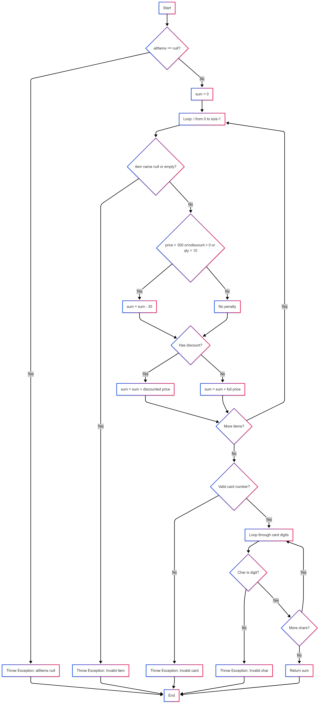

# SI_2025_lab2_233149

Стефан Савески 233149

2.

3.
V(G) = број на одлуки + 1
(каде одлуки се if, for, while, case, catch, ?:)

if (allItems == null)	#1

for (int i = 0; i < allItems.size(); i++)	#2

if (item.getName() == null		item.getName().length() == 0) #3

if (item.getPrice() > 300		item.getDiscount() > 0 #4

if (item.getDiscount() > 0)	#5

if (cardNumber != null && cardNumber.length() == 16)	#6	

for (int j = 0; j < cardNumber.length(); j++)	#7

if (allowed.indexOf(c) == -1)	#8

V(G) = 8 + 1 = 9

4.

Тест Случај 1: Null листа
Влез: allItems = null, cardNumber = "1234567890123456"

Очекуван резултат: Исклучок: "allItems list can't be null!"

Опфатено: Валидација на null листа

Тест Случај 2: Невалидно име на предмет
Влез:
allItems = [Item(name=null, price=100, discount=0, quantity=1)]
cardNumber = "1234567890123456"

Очекуван резултат: Исклучок: "Invalid item!"

Опфатено:

Проаѓа allItems != null

Влегува во for-loop

Услов за невалидно име

Тест Случај 3: Невалидна картичка (симболи)
Влез:
allItems = [Item(name="A", price=100, discount=0, quantity=1)]
cardNumber = "1234-5678-9012-3456"

Очекуван резултат: Исклучок: "Invalid character in card number!"

Тест Случај 4: Валиден влез (со и без попуст)
Влез:
allItems = [
  Item(name="A", price=100, discount=0.1, quantity=2),   // со попуст
  Item(name="B", price=50, discount=0, quantity=3)       // без попуст
]
cardNumber = "1234567890123456"
Очекуван резултат:
sum = (100 * 0.9 * 2) + (50 * 3) = 180 + 150 = 330

Овие 4 тест случаи ја покриваат секоја изјава (statement) барем еднаш.

5.
| Test | A (price > 300) | B (discount > 0) | C (quantity > 10) | A ∨ B ∨ C | Треба да се активира пенал? |
| ---- | --------------- | ---------------- | ----------------- | --------- | --------------------------- |
| 1    | F               | F                | F                 | F         | ❌ Не                        |
| 2    | F               | F                | T                 | T         | ✅ Да                        |
| 3    | F               | T                | F                 | T         | ✅ Да                        |
| 4    | F               | T                | T                 | T         | ✅ Да                        |
| 5    | T               | F                | F                 | T         | ✅ Да                        |
| 6    | T               | F                | T                 | T         | ✅ Да                        |
| 7    | T               | T                | F                 | T         | ✅ Да                        |
| 8    | T               | T                | T                 | T         | ✅ Да                        |

